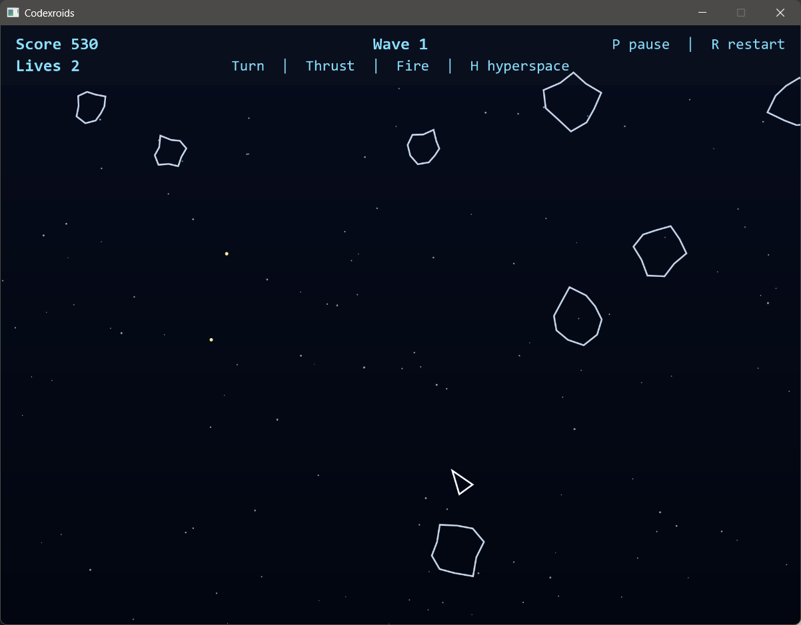

# Codexroids

Standalone JavaFX asteroid-field arcade shooter built for JDK 25.



## Requirements

- JDK 25
- Maven 3.9+

## Build

```bash
mvn clean package
```

Release app image:

```bash
mvn -Prelease -DskipTests package
```

## Run

```bash
mvn javafx:run
```

## How to Play

Controls:
- Left / Right: rotate
- Up: thrust
- Space: fire
- H: hyperspace
- Enter or Space: start next game
- P: pause
- R: restart

Features:
- Wraparound asteroid arena
- Splitting rocks, particle bursts, and extra-life scoring
- Shared JavaFX release packaging with jpackage app-image

## License

MIT. See `LICENSE`.
